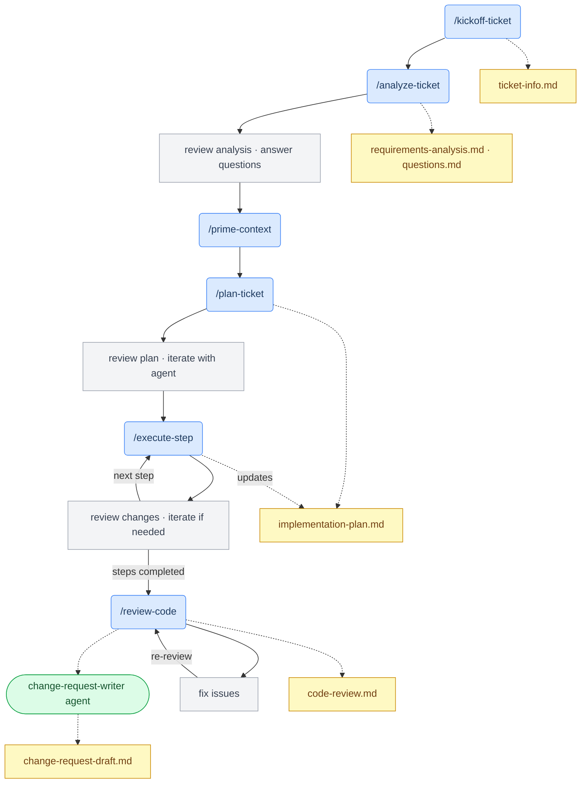

# dotclaude

My current, (mostly) portable Claude-assisted engineering workflow to help turn tickets into pull requests based around a simple idea: implementation isn't the bottleneck - specification and verification are. That's where my attention should be.

**[Full philosophy and lessons learned →](docs/philosophy.md)**

---

## Principles (the short version)

- **Specification is the product** — Clear requirements in, good results out
- **Verification builds trust** — AI earns autonomy, we don't trust it by default
- **Artifacts over memory** — Context is hard to manage and hard to reason about, files on disk endure
- **Human-in-the-loop (for now)** — Review agent output at checkpoints, widen the checkpoints as confidence grows
- **Portable by default** — Discover tools at runtime, don't bake them into the workflow

---

## Commands

| Command | Purpose | Output |
| --- | --- | --- |
| `/kickoff-ticket` | Fetch ticket, create workspace | `ticket-info.md` |
| `/analyze-ticket` | Extract requirements, surface gaps and blockers | `requirements-analysis.md`, `questions.md` |
| `/prime-context` | Load project structure and docs into context | — |
| `/plan-ticket` | Create step-by-step implementation plan | `implementation-plan.md` |
| `/execute-step` | Implement one step with verification | Updates `implementation-plan.md` |
| `/review-code` | Self-review against requirements and standards | — |

## Agent

| Agent | Purpose | Output |
| --- | --- | --- |
| `change-request-writer` | Draft PR/MR description from diff and ticket context | `change-request-draft.md` |

---

## Workflow



## Typical session

```bash
/kickoff-ticket PROJ-142        # Fetch ticket, create workspace on disk
/analyze-ticket                 # Extract requirements, flag gaps

# → review analysis, answer any questions, add any context missing from the ticket

/prime-context                  # Load project structure
/plan-ticket                    # Create implementation plan

# → review plan, refine if needed, iterate with the agent until it's solid

/execute-step                   # Implement step 1

# → review, iterate with the agent if needed, agent updates plan as we go

/execute-step                   # Implement step 2 ...

# → review, iterate with the agent if needed, agent updates plan as we go

# → repeat until complete

/review-code                    # Self-review before PR - using existing or clean context

# → invoke change-request-writer agent
```

## Generated workspace structure

Each ticket creates a workspace directory in your project, with artifacts generated as we progress through the workflow:

```
.ai-workspace/
└── PROJ-142_add-email-preferences/
    ├── ticket-info.md              # Ticket details (for session resume)
    ├── requirements-analysis.md    # Requirements + readiness assessment
    ├── questions.md                # Blockers and open questions
    ├── implementation-plan.md      # Steps with [TODO]/[DONE] tracking and evaluation of magnitude/complexity
    └── change-request-draft.md     # Generated PR description
```

These files enable session resume - return to a ticket in a new conversation and `/execute-step` can pick up where you left off.

---

## Setup

Copy the files into your user-level Claude configuration:

```bash
# Clone the repo
git clone https://github.com/kalopilato/dotclaude.git
cd dotclaude

# Copy to your Claude config
cp -r commands ~/.claude/
cp -r agents ~/.claude/
cp CLAUDE.md ~/.claude/
```

Commands are available as `/kickoff-ticket`, `/execute-step`, etc in any new conversation.

### Prerequisites

- **Ticket system**: An MCP connection to your ticket system (Linear, Jira, GitHub Issues, etc.)
- **Git CLI**: `gh` (GitHub) or `glab` (GitLab) for PR/MR operations

### Global gitignore

Workspace files shouldn't be committed to your projects:

```bash
echo ".ai-workspace/" >> ~/.gitignore_global
git config --global core.excludesfile ~/.gitignore_global
```

---

## Current status

**What works:**

- Core workflow is effective - has been my daily driver for around a year now (though it has iteratively improved over that time)
- I estimate approximately 2-3x efficiency gains on well-specified tickets
- Single-conversation context accumulation maintains the level of context I want as I move through the workflow
- Artifacts for persistence and review-ability work well - I'm no longer concerned about what I'll lose if I `/compact` or `/clear`

**What's rough:**

- Manual invocation at each step - this is a presentation of **Verification builds trust** and is reducing over time
- No automated verification layer - I see this as key to increased autonomy and efficiency, but non-trivial to do well
- Some tool-specific references need abstraction

---

## Roadmap

**Near term:**

- Genericize tool references (ticket system, git provider)
- Consolidate setup commands (`/start-ticket` combining kickoff + analyze + prime)
- Migrate to Claude skills for better structure

**Next iteration:**

- Verification agents (requirements, standards, adversarial review)
- Execution logging with drift summary
- Clearer documentation of decisions made during execution (for better review and session resume)
- Auto-correction loop before surfacing for human review
- Tiered execution modes (stepwise → checkpoint → autonomous)

For more thinking on where this is heading, see [docs/philosophy.md](docs/philosophy.md).

---

## Claude Directory structure

```
~/.claude/
├── CLAUDE.md                       # Workspace directory config
├── commands/
│   ├── prime-context.md
│   ├── kickoff-ticket.md
│   ├── analyze-ticket.md
│   ├── plan-ticket.md
│   ├── execute-step.md
│   └── review-code.md
└── agents/
    └── change-request-writer.md
```

---

## Contributing

This is a personal workflow shared in case it's useful. If you try it and something doesn't work, or you extend it in interesting ways, I'd love to hear about it.

---

## License

MIT
