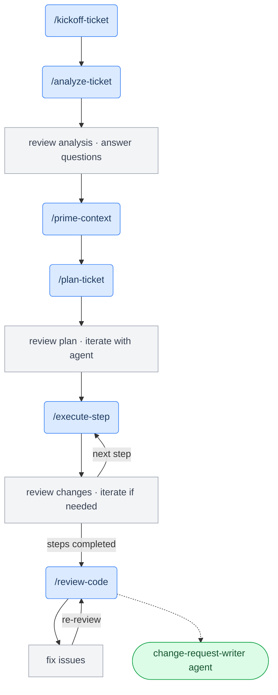

# dotclaude

A portable collection of Claude Code commands and agents for AI-assisted software engineering. Implements a structured ticket-to-change-request workflow that adapts to any tech stack, ticket system, or git host.

---

## Philosophy

**Intent-based, not prescriptive.** Commands describe *what* to achieve, not *how*. The AI discovers your project's tools, patterns, and conventions at runtime from the project's own `CLAUDE.md` and codebase — so the same workflow adapts to a Rails monolith, a Go microservice, or a TypeScript frontend without reconfiguration.

**Human in the loop.** Each command is an explicit invocation. The implementation pipeline waits for human review between steps — the AI does the work, you decide when to continue.

**Conversation as glue.** Ticket data and requirements flow through conversation context across pipeline steps, avoiding redundant fetches. Workspace files persist state across sessions so work can be resumed in a new conversation without losing progress.

**Zero configuration.** The ticket system is discovered from whatever MCP tools are connected. The git provider is detected from the remote URL. Nothing to configure before you start.

---

## Workflow



### Commands

| Command | What it does | Creates |
|---------|-------------|---------|
| `/prime-context` | Load project structure and docs into context | — |
| `/kickoff-ticket` | Fetch ticket, create workspace directory | `ticket-info.md` |
| `/analyze-ticket` | Extract requirements, assess ticket readiness, identify blockers | `requirements-analysis.md`, `questions.md` |
| `/plan-ticket` | Create step-by-step implementation plan | `implementation-plan.md` |
| `/execute-step` | Implement one step: code + tests + verification | progress in `implementation-plan.md` |
| `/review-code` | Self or peer code review against ticket requirements | — |

### Agent

| Agent | What it does | Creates |
|-------|-------------|---------|
| `change-request-writer` | Draft change request description from git diff and ticket context | `change-request-draft.md` |

### Typical session

```
/prime-context                  # Load project structure
/kickoff-ticket PROJ-142        # Fetch ticket, create workspace
/analyze-ticket                 # Extract requirements, flag gaps
# → answer any blocker questions
/plan-ticket                    # Create implementation plan
# → review plan, refine if needed
/execute-step                   # Implement step 1
# → review changes, iterate
/execute-step                   # Implement step 2
# → ... repeat until all steps done
/review-code PROJ-142           # Self-review before submitting
# → fix any issues, re-review
# → run change-request-writer agent to draft description
```

---

## Setup

At some point I'd like to make this 'installable' somehow (Claude plugin maybe? TBD), but for now just copy the files you want into `~/.claude/` and customize as needed:

```bash
cp commands/*.md ~/.claude/commands/
cp agents/*.md ~/.claude/agents/
cp CLAUDE.md ~/.claude/CLAUDE.md
```

That's it. The commands are immediately available as `/kickoff-ticket`, `/execute-step`, etc.

To get updates, pull the repo and re-copy.

### Prerequisites

- A ticket system MCP connected in Claude Code (Linear, GitHub Issues, etc.) — needed for `/kickoff-ticket` and `/analyze-ticket`
- `gh` or `glab` CLI installed — needed for PR/MR operations in `/review-code`

### Global gitignore

Workspace files are generated per-project and shouldn't be committed to your projects. Add `.ai-workspace/` to your global gitignore:

```bash
echo ".ai-workspace/" >> ~/.gitignore_global
git config --global core.excludesfile ~/.gitignore_global
```

---

## Directory structure

```
~/.claude/
├── CLAUDE.md                       # Workspace directory default
├── commands/
│   ├── prime-context.md
│   ├── kickoff-ticket.md
│   ├── analyze-ticket.md
│   ├── plan-ticket.md
│   ├── execute-step.md
│   └── review-code.md
└── agents/
    └── change-request-writer.md
```

### Workspace anatomy

Each ticket creates a directory in `.ai-workspace/` inside your project:

```
.ai-workspace/
└── PROJ-142_add-email-notification-preferences/
    ├── ticket-info.md              # Ticket details (for session resume)
    ├── requirements-analysis.md   # Requirements + readiness assessment
    ├── questions.md                # Blocker questions (if any)
    ├── implementation-plan.md      # Step-by-step plan with [TODO]/[DONE] tracking
    └── change-request-draft.md    # Generated change request description
```

These files double as session resume artifacts — if you start a ticket on Monday and return Wednesday in a new conversation, `/execute-step` reads them to restore context automatically.
